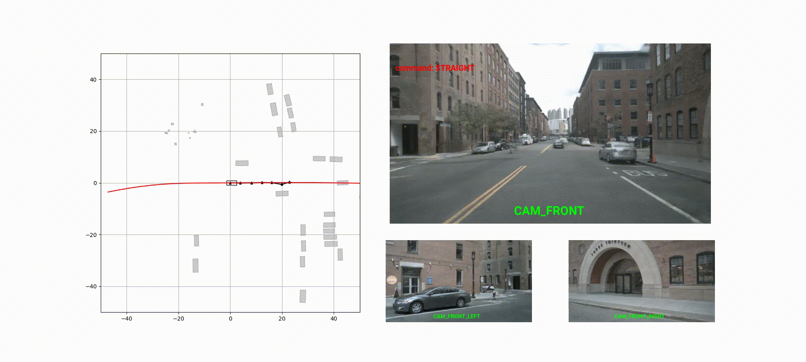

<div align="center">

# Video Action Model

[](https://www.nature.com/articles/nature14539) <br>
[](https://github.com/pre-commit/pre-commit)
[](https://pytorch.org/get-started/locally/)
[](https://pytorchlightning.ai/)
[](https://hydra.cc/)
<a href="https://github.com/ashleve/lightning-hydra-template"></a><br>
[](https://black.readthedocs.io/en/stable/)
[](https://pycqa.github.io/isort/) <br>
[](https://github.com/valeoai/VideoActionModel#license)

</div>

## Install

To use the world model, you need to install the following dependencies:

```bash
git clone https://www.github.com/valeoai/VideoActionModel
cd VideoActionModel
pip install -e .
# We tested the repo with torch == 2.4.0; to install torch at the same time:
# pip install -e ".[torch]"
# to code:
# pip install -e ".[dev]"
```

On our SLURM cluster we first create a virtual environment with the following command:

```bash
bash scripts/create_vam_env_jeanzay.sh
```

We can then use the repository with the following command:

```bash
module purge
module load arch/h100
module load pytorch-gpu/py3/2.4.0
export PYTHONUSERBASE=$WORK/python_envs/video_action_model
```

## Repository structure

```bash
VideoActionModel
|––––inference  # Things related to Neuro-NCAP evaluation
|--------scripts  # Scripts to run the evaluation
|––––mup_shapes  # mup parametrization
|––––notebooks
|--------qualitative*.ipynb  # Qualitative examples for Vavim an Vavam
|--------scaling_laws.ipynb  # notebook to compute the scaling laws of vavim
|––––scripts  # Several useful scripts: fusing deepspeed checkpoints, evaluations, etc...
|––––vam  # Main source code for our project
|--------action_expert  # Implementation of the action expert
|--------datalib  # Data pre-processing and loading
|--------evaluation  # Evaluation utils
|--------video_pretraining  # Implementation of the GPT-style model
```

## Data

Follow the instructions in the [datalib](vam/datalib/README.md) folder.

## Training

The SLURM configurations provided in this repository is specifically tailored for the French Jean-Zay cluster. While it should be compatible with other SLURM clusters, users are responsible for verifying and adapting the scripts, e.g. `jeanzay_slurm_job_submit.py`, to meet their own system requirements.

### Pre-training

```bash
python jeanzay_slurm_job_submit.py \
-n GPT2_OpenDV_Llamagen_768_Nodes16_BSperGPU6_totalBS384_weight_decay1e-07 \
--gpus_per_node 4 --nodes 16 \
-wt 20:00:00 \
-p 'experiment=video_pretraining_GPT2_llamagen_ds16_16384_opendv data.batch_size=6 paths.output_dir=$ycy_ALL_CCFRSCRATCH/VAM_test model.network.embedding_dim=768 callbacks=callbacks_opendv_training model.optimizer_conf.weight_decay=1e-07 model.network.init_std=0.0289 model.optimizer_conf.lr=0.0041 data.num_workers=6 ++trainer.max_epochs=1 ++trainer.val_check_interval=0.25'
```

### Fine-tuning

```bash
python jeanzay_slurm_job_submit.py \
-n Finetuned_0000038823_mixOpendvNuplanNuscenes_GPT2_Llamagen_768_Nodes16_BSperGPU6_totalBS384_weight_decay1e-07 \
--gpus_per_node 4 --nodes 16 \
-wt 02:30:00 \
-p 'experiment=finetune_mix_complet data.batch_size=6 paths.output_dir=$ycy_ALL_CCFRSCRATCH/output_data/opendv_gpt2_LlamaGen/finetuned  model.network.embedding_dim=768 model.optimizer_conf.weight_decay=1e-07 model.optimizer_conf.lr=0.0041  data.num_workers=6 ckpt_path="$ycy_ALL_CCFRSCRATCH/output_data/opendv_gpt2_LlamaGen/wd_sweep/GPT2_OpenDV_Llamagen_1024_Nodes32_BSperGPU3_totalBS384_weight_decay1e-07_0118_0114_1737159286/checkpoints/quarters_epoch\=000_step\=0000038823.ckpt"'
```

### Action learning

```bash
python jeanzay_slurm_job_submit.py \
-n VAM_pretrained0000038823_DDP_Nodes6_BSperGPU16_totalBS384_attdim768_actdim192 \
--gpus_per_node 4 \
--nodes 6 \
-wt 10:00:00 \
-p 'experiment=action_learning data.batch_size=16 model.vam_conf.gpt_config.embedding_dim=768  model.vam_conf.action_config.embedding_dim=192 model.vam_conf.action_config.init_std=0.0086 model.optimizer_conf.lr=0.0194  model.optimizer_conf.weight_decay=1e-07 paths.output_dir=$ycy_ALL_CCFRSCRATCH/output_data/VAM ++trainer.max_epochs=1 data.num_workers=6 model.vam_conf.gpt_checkpoint_path="$ycy_ALL_CCFRSCRATCH/output_data/opendv_gpt2_LlamaGen/finetuned/Finetuned_0000038823_mixOpendvNuplanNuscenes_GPT2_Llamagen_768_Nodes16_BSperGPU6_totalBS384_weight_decay1e-07_0119_1726_1737303976/checkpoints/end_of_epoch_epoch\=001_step\=0000054354_fused.pt" trainer.strategy=ddp +model.grad_logging=100'
```

If not on SLURM, you can launch the `vam/train.py` script, and add the following to the command lines:

```bash
name=XXX \  # Name of the experiment
++trainer.devices=XXX \  # Number of GPUs per node
++trainer.num_nodes=XXX \  # Number of nodes
```

## Inference

### Downloading the pretrained models

The models are stored on the GitHub release.

### Video generation

```python
import torch

from vam.datalib import OpenDVTokensDataset, torch_image_to_plot
from vam.utils import expand_path, plot_multiple_images
from vam.video_pretraining import load_pretrained_gpt

# Load the pretrained model and the tokenizer decoder.
gpt = load_pretrained_gpt(expand_path("XXX"))
image_detokenizer = torch.jit.load(expand_path("XXXX")).to("cuda")

# Load the dataset.
dts = OpenDVTokensDataset(
    data_root_dir="XXXX",
    video_list=["5pAf38x5z9Q"],  # This is one of the validation video from OpenDV
    sequence_length=8,
    subsampling_factor=5,
)

# Upper bound quality with ground truth tokens.
visual_tokens = dts[100]["visual_tokens"].to("cuda", non_blocking=True)
gt_images = image_detokenizer(dts[100]["visual_tokens"].to("cuda", non_blocking=True))
gt_images = torch_image_to_plot(gt_images)
_ = plot_multiple_images(gt_images, 2, 4)

# Generate 4 frames in the future from the first 6 frames.
# Note: we can use bloat16 on A100 or H100 GPUs.
with torch.amp.autocast("cuda", dtype=torch.bfloat16):
    generated_frames = gpt.forward_inference(
        number_of_future_frames=4,
        burnin_visual_tokens=visual_tokens.unsqueeze(0)[:, :6],
    )

pred_images = image_detokenizer(generated_frames.squeeze(0))
pred_images = torch_image_to_plot(pred_images)
_ = plot_multiple_images(pred_images, 1, 4)
```

### Action generation

```python
import pickle

import torch
from einops import rearrange, repeat

from vam.action_expert import load_inference_VAM
from vam.datalib import EgoTrajectoryDataset
from vam.evaluation import min_ade
from vam.utils import expand_path

vam = load_inference_VAM(expand_path("XXX"), "cuda")

with open("XXX", "rb") as f:
    nuscenes_pickle_data = pickle.load(f)

dataset = EgoTrajectoryDataset(
    pickle_data=nuscenes_pickle_data,
    tokens_rootdir=expand_path("XXX"),
)

num_sampling = 5
sample = dataset[0]
visual_tokens = sample["visual_tokens"].to("cuda", non_blocking=True)
visual_tokens = repeat(visual_tokens, "t h w -> b t h w", b=num_sampling)
commands = sample["high_level_command"].to("cuda", non_blocking=True)[-1:]
commands = repeat(commands, "t -> b t", b=num_sampling)

with torch.amp.autocast("cuda", dtype=torch.bfloat16):
    trajectory = vam(visual_tokens, commands, torch.bfloat16)

ground_truth = sample["positions"].to("cuda", non_blocking=True)[-1:]

ground_truth = sample["positions"].to("cuda", non_blocking=True)[-1:]
trajectory = rearrange(trajectory, "s 1 t a -> 1 s t a")
loss = min_ade(trajectory, ground_truth)
print(loss)
```

### Notebooks

Find examples in the [notebooks](notebooks) folder.

## Evaluation

### Neuro-NCAP

Please follow instruction on: [Neuro-NCAP](inference/README.md).



### Humming bird

```python
from einops import rearrange

from vam.evaluation.datasets import CityscapesDataset
from vam.evaluation.hbird import hbird_evaluation
from vam.utils import expand_path
from vam.video_pretraining import load_pretrained_gpt


gpt = load_pretrained_gpt(expand_path("xxx"))
image_tokenizer = torch.jit.load(expand_path("xxx")).to("cuda")
model_info = {
    "patch_size": 16,
    "d_model": gpt.embedding_dim,
}

def forward_fn(x: Tensor, inference: bool) -> Tensor:
    x = image_tokenizer(x)
    x = rearrange(x, "(b t) h w -> b t h w", t=1)
    x = gpt.get_intermediate_layers(x.unsqueeze(1), 12)
    x = rearrange(x[:, -1], "b h w d -> b (h w) d")
    return x

train_dts = CityscapesDataset(root="xxx", split="train")
val_dts = CityscapesDataset(root="xxx", split="val")

logs, preds = hbird_evaluation(
    ftr_extr_fn=forward_fn,
    model_info=model_info,
    train_dataset=train_dts,
    val_dataset=val_dts,
    batch_size=16,
    batch_size_eval=16,
    augmentation_epoch=1,
    device="cuda",
    dtype="fp16",
    return_labels=False,
    num_neighbour=30,
    nn_params=None,
    memory_size="x10",  # you can set this to reduce memory size
    f_mem_p=None,
    l_mem_p=None,
)

print(logs["mIoU"], logs["IoU"])
```

### Humming bird depth

You can generate the pseudo-depth map using the following code:

```bash
python scripts/depth_anything_a_dataset.py --dataset_name cityscapes
python scripts/depth_anything_a_dataset.py --dataset_name cityscapes --compute_only_issues
```

This should be a standalone script. It was not exstensively tested.

## TODO

- [ ] Details of commands to run all different experiments.
- [ ] Upload the pretrained models.
- [ ] Upload the tokenizers (or the script to create JIT files).
- [ ] Upload pickle files for nuplan / nuscenes.
- [ ] Upload refined metadata for opendv.
- [ ] Add the License.
- [x] Remove hard coded paths from the different eval scripts.

## Acknowledgements

## Compute

## Sources

This code was inspired / contains parts of the following repositories:

- [lightning-hydra-template](https://github.com/ashleve/lightning-hydra-template)
- [nanoGPT](https://github.com/karpathy/nanoGPT)
- [LLamaGen](https://github.com/FoundationVision/LlamaGen)
- [open-pi-zero](https://github.com/allenzren/open-pi-zero)
- [open-hummingbird-eval](https://github.com/vpariza/open-hummingbird-eval)

## License

## Citation
